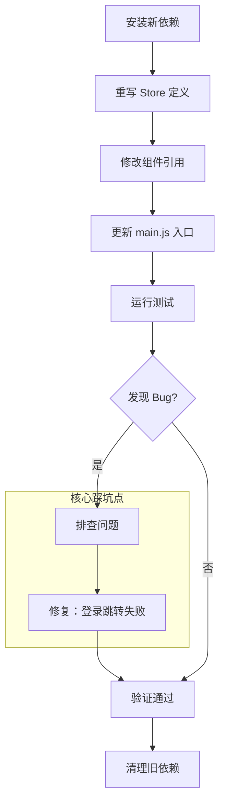

# Vuex 到 Pinia 状态管理迁移详解

这份文档旨在将简历中的技术亮点与实际项目代码进行一一对应，帮助您在面试中能够深入浅出地讲解实现原理和踩坑经历。

---

## 1. 核心背景与迁移动机

### 1.1 为什么要从 Vuex 迁移到 Pinia？

2021 年 11 月，Vue 官方宣布 **Pinia 成为 Vue 生态的官方状态管理库**，Vuex 进入维护模式。对于 Vue 3 项目，Pinia 已成为最佳实践。

**技术对比：**

| 维度             | Vuex 4                                | Pinia                            | 迁移收益        |
| ---------------- | ------------------------------------- | -------------------------------- | --------------- |
| **API 复杂度**   | state + mutations + actions + getters | state + actions (移除 mutations) | 代码量减少 ~30% |
| **TypeScript**   | 需要大量类型声明                      | 开箱即用，自动推导               | 维护成本降低    |
| **模块化**       | 需要 `modules` 嵌套配置               | 每个 Store 独立文件              | 解耦更彻底      |
| **访问语法**     | `store.state.module.xxx`              | `store.xxx`                      | 更直观          |
| **DevTools**     | 支持                                  | 更好的时间旅行调试               | 开发体验提升    |
| **Vue 官方态度** | 维护模式                              | 官方推荐                         | 技术栈更新      |

---

### 1.2 本项目的迁移范围

**涉及文件：**

```
src/
├── store/
│   ├── index.js    ← 重写 (createStore → createPinia)
│   └── menu.js     ← 重写 (Vuex 模块 → defineStore)
├── main.js         ← 修改注册方式 + 路由守卫逻辑
├── router/index.js ← 修改 localStorage key
├── components/
│   ├── aside.vue       ← 修改状态访问方式
│   ├── treeMenu.vue    ← 修改 commit → action
│   └── navHeader.vue   ← 修改 commit → action + localStorage key
└── views/
    └── login/index.vue ← 修改 commit → action + 【核心】修复路由跳转问题
```

---

## 2. 迁移流程全链路详解

**整体流程图：**



---

## 3. 核心代码迁移对比

### 3.1 Store 定义迁移

#### Vuex 写法 (旧)

```javascript
// 📁 src/store/menu.js (Vuex 版本)

// 从 localStorage 读取持久化数据
const localData = localStorage.getItem('Vuex_data')
const state = localData
  ? localData.menu
  : {
      isCollapse: false,
      selectMenu: [],
      routerList: [],
      menuActive: '1-1',
    }

// Vuex 必须通过 mutations 修改 state
const mutations = {
  collapseMenu(state) {
    state.isCollapse = !state.isCollapse
  },
  addMenu(state, data) {
    if (state.selectMenu.findIndex((item) => item.path === data.path) === -1) {
      state.selectMenu.push(data)
    }
  },
  closeMenu(state, data) {
    const index = state.selectMenu.findIndex((item) => item.name === data.name)
    state.selectMenu.splice(index, 1)
  },
  DynamicMenuRender(state, data) {
    // 动态路由解析逻辑...
    state.routerList = data
  },
  updateMenuActive(state, data) {
    state.menuActive = data
  },
}

export default { state, mutations }
```

```javascript
// 📁 src/store/index.js (Vuex 版本)

import { createStore } from 'vuex'
import menu from './menu'
import createPersistedState from 'vuex-persistedstate'

export default createStore({
  plugins: [
    new createPersistedState({
      key: 'Vuex_data', // localStorage key
    }),
  ],
  modules: {
    menu, // 嵌套模块
  },
})
```

---

#### Pinia 写法 (新)

```javascript
// 📁 src/store/menu.js (Pinia 版本)

import { defineStore } from 'pinia'

export const useMenuStore = defineStore('menu', {
  // 🔥 state 改为函数返回对象
  state: () => ({
    isCollapse: false,
    selectMenu: [],
    routerList: [],
    menuActive: '1-1',
  }),

  // 🔥 移除 mutations，actions 直接修改 state
  actions: {
    collapseMenu() {
      this.isCollapse = !this.isCollapse // 直接用 this
    },
    addMenu(data) {
      if (this.selectMenu.findIndex((item) => item.path === data.path) === -1) {
        this.selectMenu.push(data)
      }
    },
    closeMenu(data) {
      const index = this.selectMenu.findIndex((item) => item.name === data.name)
      this.selectMenu.splice(index, 1)
    },
    dynamicMenuRender(backendMenuList) {
      // 动态路由解析逻辑...
      this.routerList = backendMenuList
    },
    updateMenuActive(data) {
      this.menuActive = data
    },
  },

  // 🔥 持久化配置内置到 Store 定义中
  persist: {
    key: 'pinia_menu',
    storage: localStorage,
  },
})
```

```javascript
// 📁 src/store/index.js (Pinia 版本)

import { createPinia } from 'pinia'
import piniaPluginPersistedstate from 'pinia-plugin-persistedstate'

const pinia = createPinia()
pinia.use(piniaPluginPersistedstate)

export default pinia
```

---

### 3.2 组件使用方式迁移

#### Vuex 调用方式 (旧)

```javascript
// 📁 任意组件

import { useStore } from 'vuex'
import { computed } from 'vue'

const store = useStore()

// 读取 state：需要穿透 module 层级
const isCollapse = computed(() => store.state.menu.isCollapse)
const routerList = computed(() => store.state.menu.routerList)

// 修改 state：必须通过 commit 调用 mutation
store.commit('collapseMenu')
store.commit('addMenu', item.meta)
store.commit('DynamicMenuRender', menuData)
```

---

#### Pinia 调用方式 (新)

```javascript
// 📁 任意组件

import { useMenuStore } from '@/store/menu'
import { computed } from 'vue'

const menuStore = useMenuStore()

// 读取 state：直接访问，无需穿透
const isCollapse = computed(() => menuStore.isCollapse)
const routerList = computed(() => menuStore.routerList)

// 修改 state：直接调用 action 方法
menuStore.collapseMenu()
menuStore.addMenu(item.meta)
menuStore.dynamicMenuRender(menuData)
```

---

### 3.3 主要变更对照表

| 场景                 | Vuex                                 | Pinia                                         |
| -------------------- | ------------------------------------ | --------------------------------------------- |
| **导入 Store**       | `import { useStore } from 'vuex'`    | `import { useMenuStore } from '@/store/menu'` |
| **获取实例**         | `const store = useStore()`           | `const menuStore = useMenuStore()`            |
| **读取 State**       | `store.state.menu.xxx`               | `menuStore.xxx`                               |
| **修改 State**       | `store.commit('mutationName', data)` | `menuStore.actionName(data)`                  |
| **localStorage Key** | `Vuex_data`                          | `pinia_menu`                                  |
| **数据结构**         | `{ menu: { routerList: [...] } }`    | `{ routerList: [...] }`                       |

---

## 4. 核心踩坑：持久化异步导致的路由跳转失败

### 4.1 问题现象

迁移完成后，登录功能出现 Bug：**登录成功后页面无法跳转到控制台，停留在登录页或跳转到空白页**。

但是：

- 使用 Vuex 时完全正常
- 仅改了状态库，业务逻辑没变
- 刷新页面后能正常进入

---

### 4.2 问题定位

**原代码逻辑：**

```javascript
// 📁 src/views/login/index.vue (迁移后)

// 登录成功后...
menuStore.dynamicMenuRender(res.data.data) // 1. 更新 Pinia state
router.push('/') // 2. 跳转首页，触发 redirect 函数
```

```javascript
// 📁 src/router/index.js

redirect: (to) => {
  const localData = localStorage.getItem('pinia_menu') // 3. 从 localStorage 读取
  if (localData) {
    const routerList = JSON.parse(localData).routerList
    // 计算跳转路径...
  }
  return '/login' // 4. 如果没读到数据，回到登录页
}
```

**问题发现**：步骤 2 执行时，步骤 1 的持久化还没完成写入！

---

### 4.3 根因分析：持久化插件的写入时机差异

| 插件                            | 监听机制                          | 写入时机                   |
| ------------------------------- | --------------------------------- | -------------------------- |
| **vuex-persistedstate**         | `store.subscribe` (Mutation 订阅) | **同步写入**               |
| **pinia-plugin-persistedstate** | `$subscribe` (State Patch 订阅)   | **微任务/异步** (性能优化) |

**时序对比：**

```
=== Vuex (成功) ===
1. store.commit() 执行
2. Mutation 触发 → 插件同步写入 localStorage ✅
3. router.push('/') 执行
4. redirect 读取 localStorage → 有数据 ✅ → 跳转成功

=== Pinia (失败) ===
1. menuStore.action() 执行
2. State 变更 → 插件标记为待写入 ⏳ (放入微任务队列)
3. router.push('/') 执行 (同步代码继续)
4. redirect 读取 localStorage → 空！❌ → 跳转回 /login
5. 微任务执行 → 插件写入 localStorage (太晚了)
```

---

### 4.4 解决方案：从内存直接计算跳转路径

**核心思路**：登录成功后，不依赖 `router.push('/')` 触发的 `redirect`，而是直接从 Pinia Store（内存）中计算目标路径。

**修复后代码：**

```javascript
// 📁 src/views/login/index.vue

// 登录成功后...
menuStore.dynamicMenuRender(res.data.data)

// 🔥 【修复】直接从内存计算跳转路径
let redirectPath = '/'
const menus = toRaw(routerList.value) // 从 Pinia Store 读取（内存）

if (menus && menus.length > 0) {
  const firstItem = menus[0]
  if (firstItem.children && firstItem.children.length > 0) {
    redirectPath = firstItem.children[0].meta.path // 有子菜单
  } else {
    redirectPath = firstItem.meta.path // 无子菜单
  }
}

router.push(redirectPath) // 直接跳转到计算好的路径
```

---

### 4.5 为什么这个方案更健壮？

| 方案   | 数据来源           | 依赖                       |
| ------ | ------------------ | -------------------------- |
| 旧方案 | localStorage       | 依赖持久化插件的写入速度   |
| 新方案 | Pinia Store (内存) | 仅依赖 JavaScript 同步赋值 |

**结论**：无论持久化是同步还是异步，**内存中的 State 永远是最新的**。

---

## 5. 完整迁移步骤复盘

### Step 1：安装新依赖

```bash
npm install pinia pinia-plugin-persistedstate
```

### Step 2：重写 Store 定义

参考 3.1 节的代码对比，将 Vuex 模块改写为 Pinia Store。

**关键变更：**

- `state` 改为函数返回对象
- `mutations` 和 `actions` 合并为 `actions`
- 使用 `this` 直接访问和修改 state
- 持久化配置移入 `persist` 字段

### Step 3：修改 main.js 入口

```javascript
// 📁 src/main.js

import { createApp } from 'vue'
import { createPinia } from 'pinia'
import piniaPluginPersistedstate from 'pinia-plugin-persistedstate'
import { useMenuStore } from '@/store/menu'

const app = createApp(App)

// 注册 Pinia
const pinia = createPinia()
pinia.use(piniaPluginPersistedstate)
app.use(pinia)

// 路由守卫中恢复动态路由
const localData = localStorage.getItem('pinia_menu')
if (localData) {
  const menuStore = useMenuStore()
  menuStore.dynamicMenuRender(JSON.parse(localData).routerList)
  menuStore.routerList.forEach((item) => {
    router.addRoute('main', item)
  })
}

app.mount('#app')
```

### Step 4：批量更新组件引用

使用全局搜索替换：

| 搜索                              | 替换                                          |
| --------------------------------- | --------------------------------------------- |
| `import { useStore } from 'vuex'` | `import { useMenuStore } from '@/store/menu'` |
| `const store = useStore()`        | `const menuStore = useMenuStore()`            |
| `store.state.menu.`               | `menuStore.`                                  |
| `store.commit('`                  | `menuStore.` (需手动调整方法名)               |
| `Vuex_data`                       | `pinia_menu`                                  |

### Step 5：更新路由配置

```javascript
// 📁 src/router/index.js

redirect: (to) => {
  // 更新 key 名称
  const localData = localStorage.getItem('pinia_menu')

  if (localData) {
    // 更新数据结构访问方式（移除 .menu 层级）
    const menus = JSON.parse(localData).routerList
    // ...
  }
}
```

### Step 6：修复登录跳转问题

参考 4.4 节的解决方案。

### Step 7：测试验证

- [ ] 登录功能正常
- [ ] 刷新页面不白屏
- [ ] 菜单高亮状态正确
- [ ] Tab 标签添加/关闭正常
- [ ] 侧边栏收起/展开正常
- [ ] 退出登录清除数据

### Step 8：清理旧依赖

```bash
npm uninstall vuex vuex-persistedstate
localStorage.removeItem('Vuex_data')  // 清理旧数据
```

---

## 6. 面试常见问题

### Q1: 为什么 Pinia 不需要 mutations 了？

> **A**: Vuex 的 mutations 存在是为了配合 DevTools 的时间旅行调试，要求状态变更必须是同步的。Pinia 重新设计了 DevTools 集成方式，即使在 actions 中直接修改 state，也能被正确追踪和回溯。这样既简化了 API，又保留了调试能力。

### Q2: 迁移过程中遇到了什么问题？

> **A**: 遇到了登录后无法跳转的问题。定位后发现是 Pinia 持久化插件使用异步写入（微任务），而原代码在 `router.push('/')` 时依赖 `localStorage` 中的数据，此时数据还没写入完成。解决方案是登录成功后直接从 Pinia Store 内存中计算跳转路径，不依赖 `localStorage`。

### Q3: 这个 Bug 给你什么启发？

> **A**:
>
> 1. **不要隐式依赖第三方库的实现细节**（如"同步写入"这种行为）
> 2. **内存数据永远比 I/O 数据更可靠**
> 3. **迁移工作要做充分的回归测试**，不能假设"逻辑没变就不会有问题"

### Q4: Pinia 的 persist 配置有哪些选项？

> **A**:
>
> ```javascript
> persist: {
>   key: 'pinia_menu',      // localStorage 的 key
>   storage: localStorage,  // 或 sessionStorage
>   paths: ['routerList'],  // 只持久化部分 state（可选）
> }
> ```

### Q5: 如何在 Pinia 中实现模块化？

> **A**: Pinia 天然是模块化的。每个 `defineStore` 就是一个独立模块，直接按文件拆分即可：
>
> ```
> src/store/
> ├── menu.js    → useMenuStore
> ├── user.js    → useUserStore
> └── order.js   → useOrderStore
> ```
>
> 使用时按需引入，不需要像 Vuex 那样配置 `modules`。

---

## 7. 简历描述建议

### 精简版

> 完成项目状态管理从 Vuex 4 到 Pinia 的平滑迁移，解决持久化插件异步写入导致的路由跳转时序问题。

### 技术深度版

> 主导状态管理库从 Vuex 4 到 Pinia 的技术升级：
>
> 1. 重构 Store 定义，合并 mutations 与 actions，代码量减少 30%
> 2. 排查并修复持久化插件异步写入导致的路由跳转竞态问题
> 3. 设计内存优先的跳转计算策略，彻底规避 I/O 延迟风险

### STAR 法则版

> **Situation**: 项目使用 Vuex 4，但 Vue 官方已推荐 Pinia 作为新标准
> **Task**: 将状态管理迁移到 Pinia，保持功能不变
> **Action**: 重写 Store 定义，批量更新组件引用；发现登录跳转失败后，定位到持久化插件的同步/异步差异，改为从内存直接计算跳转路径
> **Result**: 迁移完成，代码更简洁，解决了一个潜在的竞态条件 Bug

---

## 8. 总结

| 维度         | 收获                             |
| ------------ | -------------------------------- |
| **技术升级** | 掌握 Vuex → Pinia 的完整迁移流程 |
| **问题定位** | 理解同步/异步写入的时序差异      |
| **架构思维** | 学会"内存优先于 I/O"的设计原则   |
| **面试故事** | 有真实的踩坑经历可以展开讲述     |
