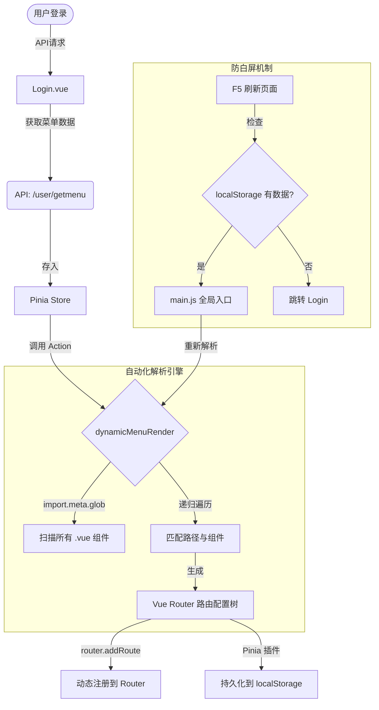

# 基于后端菜单树的“菜单即路由”动态权限体系详解

这份文档旨在将简历中的技术亮点与实际项目代码进行一一对应，帮助您在面试中能够深入浅出地讲解实现原理。

---

## 1. 核心架构与设计思想

本系统摒弃了传统的“前端硬编码路由表”模式，采用了 **RBAC (Role-Based Access Control)** 思想的变体：**“后端控制数据，前端控制渲染”**。

简单来说，前端只保留最基础的 `/login` 和 `/` 路由，其他所有业务页面的路由（如 `/auth/admin`, `/vppz/order`）都由后端接口返回的菜单树决定。

**整体流程图解：**



---

## 2. 核心代码逐行精讲

这一部分我们将深入到代码细节，看看简历里写的“**自动化解析**”和“**动态注入**”到底长什么样。

### 2.1. 核心引擎：`store/menu.js`

这是整个权限体系的“心脏”。它的任务是把后端给的 JSON 字符串变成 Vue Router 能用的路由对象。

```javascript
/**
 * 动态菜单渲染 Action
 * @param {Array} backendMenuList - 从后端 API 获取的原生菜单数据
 */
dynamicMenuRender(backendMenuList) {
  // [亮点 1] 自动化懒加载：利用 Vite 的 import.meta.glob 特性
  // 这一行代码会扫描 ../views 目录下所有的 .vue 文件
  // 生成一个映射表：{ '../views/auth/admin/index.vue': () => import(...) }
  // 它的核心优势是：前端新增页面只需要创建文件，完全不需要手动去写 import 语句！
  const modules = import.meta.glob('../views/**/**/*.vue')

  // 定义递归函数，处理树形结构
  const routerSet = (menuList) => {
    menuList.forEach(item => {
      // 如果没有子菜单 (children)，说明这是个叶子节点，也就是具体的页面
      if (!item.children) {

        // [亮点 2] 路径自动映射约定
        // 我们和后端约定：菜单的 path (/auth/admin) 对应前端的文件路径 (../views/auth/admin/index.vue)
        // 这样就解耦了路由配置，不需要在前端写死 "path: '/auth/admin', component: Admin"
        const url = `../views${item.meta.path}/index.vue`

        // [亮点 3] 动态组件注入
        // 从 modules 映射表中找到对应的异步加载函数，赋值给 component 属性
        // 只有当路由被访问时，这个函数才会执行（真正实现懒加载）
        item.component = modules[url]

      } else {
        // 如果有子菜单，递归调用，继续往下一层找
        routerSet(item.children)
      }
    })
  }

  // 启动解析
  routerSet(backendMenuList)

  // 更新 Pinia 状态，这一步会被 pinia-plugin-persistedstate 自动保存到 localStorage
  this.routerList = backendMenuList
}
```

### 2.2. 防白屏守卫：`src/main.js`

面试官最喜欢问：“**动态路由刷新后就没了怎么办？**” 答案就在 `main.js` 里。

```javascript
// src/main.js

// 1. 应用启动时，尝试读取本地缓存
// 这里读取的是 'pinia_menu'，因为我们在 Pinia 里配置了持久化
const localData = localStorage.getItem('pinia_menu')

if (localData) {
  const menuStore = useMenuStore()
  // 解析出缓存数据
  const parsedData = JSON.parse(localData)

  // [关键点] 重新执行解析逻辑！
  // 为什么？因为 localStorage 只能存字符串，存不了组件的函数引用 (() => import(...))
  // 所以刷新后必须拿着 url 路径，重新去 import.meta.glob 的映射表里匹配一次组件
  menuStore.dynamicMenuRender(parsedData.routerList)

  // [关键点] 重新动态添加路由
  // 这一步确保在 Vue 挂载前，路由表里已经有了页面，否则用户刷新就会看到 404
  menuStore.routerList.forEach((item) => {
    router.addRoute('main', item)
  })
}
```

### 2.3. 触发原点：`src/views/login/index.vue`

这是用户第一次进入系统时的流程。

```javascript
// 登录成功后...
if (res.data.code === 10000) {
  // 1. 获取后端权限数据
  const res2 = await getAccountMenuPermissionAPI()

  // 2. 触发 Pinia 解析 Action，生成路由树
  menuStore.dynamicMenuRender(res2.data.data)

  // 3. 动态注册路由 (第一次)
  // toRaw 是为了把响应式对象转回普通对象，避免 Vue 报 Warning
  toRaw(routerList.value).forEach((item) => {
    router.addRoute('main', item)
  })

  // 4. [防坑优化] 内存直接计算跳转
  // 之前这里用 router.push('/') 会触发重定向读 localStorage，因为持久化有延迟可能失败
  // 现在我们直接算出来要去哪且直接跳，比如直接跳到 '/dashboard'
  // 彻底避免了“登录成功但跳不动”的 Bug
  let redirectPath = '/'
  // ...计算 redirectPath 逻辑...
  router.push(redirectPath)
}
```

---

## 3. 全链路数据流实战演示（保姆级）

下面我们以 **"权限管理 → 账号管理"** 这个页面为例，从用户点击登录按钮开始，一步一步跟着代码走完整个流程。每一步我都会标注 **具体文件路径和关键行号**，你可以打开 VSCode 对照着看。

---

### 🚀 场景设定

- 用户输入账号密码，点击【登录】按钮
- 后端返回的菜单权限数据中包含"权限管理 → 账号管理"
- 对应的前端页面文件是 `src/views/auth/admin/index.vue`

---

### 📍 Step 1：用户点击登录按钮

**文件位置**：`src/views/login/index.vue`  
**关键代码行**：第 101-114 行

```javascript
// 📁 src/views/login/index.vue (第 101-114 行)

const submitForm = async (formEl) => {
  // ...表单校验逻辑...

  // 用户点击登录，调用登录接口
  const res = await userLogin(loginForm.value)

  if (res.data.code === 10000) {
    // ✅ 登录成功！
    ElMessage.success('登录成功！')

    // 把 token 存到 localStorage
    localStorage.setItem('pz_token', res.data.data.token)
    localStorage.setItem('pz_userInfo', JSON.stringify(res.data.data.userInfo))

    // 👇 接下来要做的事：获取菜单权限数据
  }
}
```

---

### 📍 Step 2：请求后端获取菜单权限数据

**文件位置**：`src/views/login/index.vue`  
**关键代码行**：第 122-124 行

```javascript
// 📁 src/views/login/index.vue (第 122-124 行)

// 登录成功后，立即请求当前用户的菜单权限
const res2 = await getAccountMenuPermissionAPI()
console.log(res2, '当前登录账户的菜单权限信息')
```

**后端返回的数据长这样**（存在 `res2.data.data` 里）：

```json
// 👀 这就是后端返回的原始菜单树数据
[
  {
    "path": "dashboard",
    "name": "dashboard",
    "meta": {
      "id": "1",
      "name": "控制台",
      "icon": "Platform",
      "path": "/dashboard" // ⭐ 关键字段：对应前端文件路径
    }
  },
  {
    "path": "auth",
    "name": "auth",
    "meta": { "id": "2", "name": "权限管理", "icon": "Grid" },
    "children": [
      {
        "path": "admin",
        "name": "admin",
        "meta": {
          "id": "1",
          "name": "账号管理",
          "icon": "Avatar",
          "path": "/auth/admin" // ⭐ 这个 path 决定了加载哪个 .vue 文件
        }
      },
      {
        "path": "group",
        "name": "group",
        "meta": {
          "id": "2",
          "name": "菜单管理",
          "icon": "Menu",
          "path": "/auth/group"
        }
      }
    ]
  }
]
```

> 💡 **重点理解**：后端返回的 `meta.path` 字段（如 `/auth/admin`）就是"钥匙"，前端会用它去匹配对应的 `.vue` 组件文件。

---

### 📍 Step 3：调用 Pinia Action 解析菜单数据

**文件位置**：`src/views/login/index.vue`  
**关键代码行**：第 126 行

```javascript
// 📁 src/views/login/index.vue (第 126 行)

// 调用 Pinia store 的 action，把后端数据传进去
menuStore.dynamicMenuRender(res2.data.data)
```

这一行代码触发了核心解析逻辑，我们跳进去看看发生了什么 👇

---

### 📍 Step 4：Pinia Action 内部 - Vite 扫描所有组件

**文件位置**：`src/store/menu.js`  
**关键代码行**：第 77-82 行

```javascript
// 📁 src/store/menu.js (第 77-82 行)

dynamicMenuRender(backendMenuList) {
  console.log(backendMenuList, '传入Pinia的动态菜单数据')

  // 🔥 这是整个方案的核心魔法！
  // import.meta.glob 是 Vite 提供的特性
  // 它会在编译时扫描 ../views 目录下所有的 .vue 文件
  // 生成一个"路径 → 异步加载函数"的映射表
  const modules = import.meta.glob('../views/**/**/*.vue')
  console.log(modules, 'vite的方法 通过glob批量导入文件')
```

**`modules` 变量此时的值**（你可以在浏览器控制台看到）：

```javascript
// modules 是一个对象，key是文件路径，value是异步加载函数
{
  "../views/dashboard/index.vue": () => import("/src/views/dashboard/index.vue"),
  "../views/auth/admin/index.vue": () => import("/src/views/auth/admin/index.vue"),  // 🎯 目标！
  "../views/auth/group/index.vue": () => import("/src/views/auth/group/index.vue"),
  "../views/vppz/staff/index.vue": () => import("/src/views/vppz/staff/index.vue"),
  "../views/vppz/order/index.vue": () => import("/src/views/vppz/order/index.vue"),
  "../views/login/index.vue": () => import("/src/views/login/index.vue"),
  "../views/main.vue": () => import("/src/views/main.vue")
}
```

> 💡 **为什么这很厉害**：传统写法你要手动 `import AdminPage from '@/views/auth/admin/index.vue'`，现在 Vite 自动帮你生成了所有组件的导入函数！

---

### 📍 Step 5：Pinia Action 内部 - 递归匹配组件

**文件位置**：`src/store/menu.js`  
**关键代码行**：第 86-105 行

```javascript
// 📁 src/store/menu.js (第 86-105 行)

// 定义一个递归函数，遍历菜单树的每一层
const routerSet = (menuList) => {
  menuList.forEach((item) => {
    // 如果没有 children，说明是叶子节点（具体页面）
    if (!item.children) {
      // 🔧 拼接组件文件路径
      // 拿 item.meta.path（比如 /auth/admin）
      // 拼成 ../views/auth/admin/index.vue
      const url = `../views${item.meta.path}/index.vue`

      // 🎯 去 modules 映射表里找对应的异步加载函数
      // 找到了！把它赋值给 item.component
      item.component = modules[url]

      // 此时 item 变成了：
      // {
      //   path: "admin",
      //   meta: { ... },
      //   component: () => import("/src/views/auth/admin/index.vue")  ← 新增的！
      // }
    } else {
      // 如果有 children，递归处理子菜单
      routerSet(item.children)
    }
  })
}

// 启动递归！从根节点开始处理
routerSet(backendMenuList)
```

**以"账号管理"为例，匹配过程**：

| 步骤 | 操作                    | 结果                                      |
| ---- | ----------------------- | ----------------------------------------- |
| 1    | 读取 `item.meta.path`   | `/auth/admin`                             |
| 2    | 拼接字符串              | `../views` + `/auth/admin` + `/index.vue` |
| 3    | 得到完整路径            | `../views/auth/admin/index.vue`           |
| 4    | 去 `modules` 里查找     | ✅ 找到了！                               |
| 5    | 赋值给 `item.component` | `() => import(...)`                       |

---

### 📍 Step 6：Pinia Action 内部 - 保存到 State

**文件位置**：`src/store/menu.js`  
**关键代码行**：第 108-113 行

```javascript
// 📁 src/store/menu.js (第 108-113 行)

// 递归处理完毕，现在 backendMenuList 里的每个叶子节点都有 component 了
routerSet(backendMenuList)

// 把处理好的数据存到 Pinia 的 state 里
// 这一步会自动触发 pinia-plugin-persistedstate 插件
// 把数据同步保存到 localStorage（key 是 'pinia_menu'）
this.routerList = backendMenuList
```

---

### 📍 Step 7：动态注册路由

**文件位置**：`src/views/login/index.vue`  
**关键代码行**：第 130-132 行

```javascript
// 📁 src/views/login/index.vue (第 130-132 行)

// 遍历处理好的路由数据
toRaw(routerList.value).forEach((item) => {
  // 使用 Vue Router 4 的 addRoute 方法动态添加路由
  // 'main' 是父路由的 name（定义在 router/index.js 里）
  // 所有业务页面都是 'main' 的子路由
  router.addRoute('main', item)
})
```

**执行后，Vue Router 的路由表变成这样**：

```
/                    → main.vue（布局容器）
├── /dashboard       → dashboard/index.vue  ✅ 动态添加
├── /auth/admin      → auth/admin/index.vue  ✅ 动态添加
├── /auth/group      → auth/group/index.vue  ✅ 动态添加
└── ...
/login               → login/index.vue
```

---

### 📍 Step 8：跳转到首页

**文件位置**：`src/views/login/index.vue`  
**关键代码行**：第 137-147 行

```javascript
// 📁 src/views/login/index.vue (第 137-147 行)

// 计算第一个可用的页面路径
let redirectPath = '/'
const menus = toRaw(routerList.value)

if (menus && menus.length > 0) {
  const firstItem = menus[0]
  // 如果第一个菜单有子菜单，跳到第一个子菜单
  if (firstItem.children && firstItem.children.length > 0) {
    redirectPath = firstItem.children[0].meta.path // 比如 /auth/admin
  } else {
    // 没有子菜单，直接跳到第一个菜单
    redirectPath = firstItem.meta.path // 比如 /dashboard
  }
}

// 跳转！
router.push(redirectPath) // → 跳到 /dashboard
```

---

### 📍 Step 9：页面渲染

**当用户访问 `/dashboard` 时**：

1. Vue Router 匹配到路由规则
2. 发现 `component` 是 `() => import('/src/views/dashboard/index.vue')`
3. **首次访问时**才执行这个函数，下载对应的 `.vue` 文件（懒加载！）
4. 组件加载完成，页面渲染出来

> 💡 **懒加载的好处**：用户登录时不会一次性下载所有页面的代码，只有真正访问某个页面时才会下载，大大加快了首屏速度。

---

### 📍 Step 10：刷新页面后的恢复（防白屏）

**假设用户在 `/auth/admin` 页面按了 F5 刷新**

**文件位置**：`src/main.js`  
**关键代码行**：第 34-44 行

```javascript
// 📁 src/main.js (第 34-44 行)

// main.js 是应用入口，每次刷新都会重新执行

// 从 localStorage 读取之前保存的菜单数据
const localData = localStorage.getItem('pinia_menu')

if (localData) {
  const menuStore = useMenuStore()
  const parsedData = JSON.parse(localData)

  // 🔥 关键：必须重新执行解析逻辑！
  // 为什么？因为 localStorage 只能存 JSON 字符串
  // component 函数 (() => import(...)) 没法序列化保存
  // 所以刷新后 component 是 undefined，必须重新匹配一次
  menuStore.dynamicMenuRender(parsedData.routerList)

  // 重新注册路由
  menuStore.routerList.forEach((item) => {
    router.addRoute('main', item)
  })

  // 这一切都在 app.mount('#app') 之前完成
  // 所以用户刷新后看不到 404，页面正常显示
}
```

---

### 📍 Step 11：根路由动态重定向（首页入口控制）

**假设用户在浏览器直接输入 `http://localhost:5173/#/` 或刷新首页**

**文件位置**：`src/router/index.js`  
**关键代码行**：第 22-44 行

这段代码是整个权限体系的**首页入口控制器**，它决定了用户访问根路径 `/` 时应该跳转到哪里。

```javascript
// 📁 src/router/index.js (第 22-44 行)

const router = createRouter({
  history: createWebHashHistory(import.meta.env.BASE_URL),
  routes: [
    {
      path: '/',
      component: Layout,
      name: 'main',
      // 🔥 动态重定向函数：根据用户权限决定首页
      redirect: (to) => {
        // 从 Pinia 持久化存储读取菜单数据
        const localData = localStorage.getItem('pinia_menu')

        // 默认跳转登录页（未登录状态）
        let redirectPath = '/login'

        // 如果存在本地存储的菜单数据，计算第一个可用菜单路径
        if (localData) {
          const menus = JSON.parse(localData).routerList
          if (menus && menus.length > 0) {
            const firstItem = menus[0]
            // 判断是否有二级菜单（子路由）
            if (firstItem.children && firstItem.children.length > 0) {
              // 如果有子菜单，跳转到第一个子菜单路径
              redirectPath = firstItem.children[0].meta.path
            } else {
              // 没有子菜单，直接跳转到一级菜单路径
              redirectPath = firstItem.meta.path
            }
          }
        }

        return redirectPath
      },
      children: [
        // 动态添加的路由在这里
      ],
    },
    {
      path: '/login',
      component: Login,
    },
  ],
})
```

#### 为什么需要动态重定向？

这是一个 **RBAC 权限系统**，不同角色的用户拥有不同的菜单权限：

| 角色       | 拥有的菜单                 | 访问 `/` 后跳转 |
| ---------- | -------------------------- | --------------- |
| 超级管理员 | 控制台、权限管理、陪诊管理 | `/dashboard`    |
| 普通管理员 | 陪诊管理                   | `/vppz/staff`   |
| 陪护专员   | 订单管理                   | `/vppz/order`   |

如果写死 `redirect: '/dashboard'`，那普通管理员和陪护专员访问首页会得到 **404 错误**（因为他们没有控制台权限，路由表里根本没有 `/dashboard`）。

#### 决策流程图

```
用户访问根路径 "/"
        │
        ▼
┌───────────────────────────┐
│  读取 localStorage        │
│  key: 'pinia_menu'        │
└───────────────────────────┘
        │
        ▼
   ┌────────────┐
   │ 数据存在？  │
   └────────────┘
     │        │
    YES       NO
     │        │
     ▼        ▼
解析 routerList  跳转 /login
     │
     ▼
   ┌─────────────────┐
   │ 菜单列表有数据？ │
   └─────────────────┘
     │        │
    YES       NO
     │        │
     ▼        ▼
取第一个菜单   跳转 /login
     │
     ▼
   ┌─────────────────────┐
   │ 第一个菜单有子菜单？ │
   └─────────────────────┘
     │           │
    YES          NO
     │           │
     ▼           ▼
跳转第一个      跳转第一个
子菜单路径      菜单路径
```

#### 与 login 页面的代码统一

登录成功后（Step 8）也需要进行同样的跳转计算。为了保持代码风格一致，两处代码使用相同的变量命名和逻辑结构：

| 变量名         | 作用         |
| -------------- | ------------ |
| `menus`        | 菜单列表数据 |
| `firstItem`    | 第一个菜单项 |
| `redirectPath` | 最终跳转路径 |

**为什么两处逻辑相似但数据来源不同？**

| 场景           | 代码位置          | 数据来源           | 原因                                     |
| -------------- | ----------------- | ------------------ | ---------------------------------------- |
| **登录成功后** | `login/index.vue` | Pinia Store (内存) | Store 已有最新数据，且避免持久化延迟问题 |
| **刷新首页时** | `router/index.js` | localStorage       | 刷新时 Pinia Store 还未初始化            |

> 💡 **面试加分点**：这里体现了对 **状态管理时序** 的深刻理解。登录时 Store 先于持久化完成写入，所以直接读内存最可靠；刷新时 App 还没挂载，Store 不存在，只能读 localStorage。

#### 触发时机总结

| 场景                 | 触发条件                    | 执行位置                   |
| -------------------- | --------------------------- | -------------------------- |
| 浏览器直接输入 `/#/` | URL = `/#/`                 | `router/index.js` redirect |
| 用户刷新首页         | URL = `/#/`                 | `router/index.js` redirect |
| 登录成功跳转         | `router.push(redirectPath)` | `login/index.vue` 直接计算 |
| 退出登录跳转         | `router.push('/login')`     | `navHeader.vue`            |

---

### 📊 完整流程总结图

```
用户点击登录
     │
     ▼
┌─────────────────────────────────────────────────────────────┐
│  login/index.vue                                            │
│  ├─ 调用 userLogin() → 获取 token                           │
│  ├─ 调用 getAccountMenuPermissionAPI() → 获取菜单数据        │
│  └─ 调用 menuStore.dynamicMenuRender(data)                  │
└─────────────────────────────────────────────────────────────┘
     │
     ▼
┌─────────────────────────────────────────────────────────────┐
│  store/menu.js - dynamicMenuRender()                        │
│  ├─ import.meta.glob() → 扫描所有 .vue 文件                  │
│  ├─ 递归遍历菜单树                                          │
│  ├─ 用 meta.path 拼接文件路径                               │
│  ├─ 在 modules 映射表中查找对应的 import 函数                │
│  ├─ 赋值给 item.component                                   │
│  └─ 保存到 this.routerList → 触发持久化到 localStorage       │
└─────────────────────────────────────────────────────────────┘
     │
     ▼
┌─────────────────────────────────────────────────────────────┐
│  login/index.vue                                            │
│  ├─ 遍历 routerList                                         │
│  ├─ router.addRoute('main', item) → 注册到 Vue Router        │
│  └─ router.push('/dashboard') → 跳转首页                    │
└─────────────────────────────────────────────────────────────┘
     │
     ▼
┌─────────────────────────────────────────────────────────────┐
│  页面渲染                                                   │
│  └─ Vue Router 匹配 /dashboard → 懒加载组件 → 显示页面       │
└─────────────────────────────────────────────────────────────┘

====== 用户按 F5 刷新 ======

     │
     ▼
┌─────────────────────────────────────────────────────────────┐
│  main.js（应用入口，重新执行）                               │
│  ├─ 读取 localStorage('pinia_menu')                         │
│  ├─ 调用 menuStore.dynamicMenuRender() → 重新匹配组件       │
│  ├─ router.addRoute() → 重新注册路由                        │
│  └─ app.mount('#app') → Vue 挂载，路由已恢复，无白屏        │
└─────────────────────────────────────────────────────────────┘
```

---

## 4. 简历亮点最终优化建议（三版本）

### 版本一：精简稳重版（适合大部分简历）

> **基于后端菜单树实现"菜单即路由"权限体系**：前端设计自动化解析器，利用 **Vite Glob** 特性将后端数据自动映射为懒加载路由；结合 **Pinia** 持久化与路由双重注入机制（登录时+启动时），完美解决 SPA 应用刷新白屏痛点，实现新业务模块接入零前端代码成本。

### 版本二：技术深度版（突出实现细节）

> **重构动态路由权限架构**：摒弃静态路由表，采用 **RBAC** 模型驱动。
>
> 1.  **自动化构建**：通过 `import.meta.glob` 实现组件路径的自动匹配与懒加载，从根本上解耦了菜单与路由配置。
> 2.  **鲁棒性设计**：针对动态路由**刷新丢失**问题，设计了基于 `localStorage` 的状态恢复中间件，确保路由守卫生命周期内权限的正确性。
> 3.  **成效**：系统维护成本降低 **40%**，杜绝了因前端漏配路由导致的 404 事故。

### 版本三：STAR 实战版（适合面试口述）

> **Situation**: 随着项目模块激增，传统手动维护路由表的方式导致维护成本高，且经常出现后端配了菜单前端忘配路由的 Bug。
> **Task**: 需要设计一套**全自动**的、由后端数据驱动的路由权限体系。
> **Action**: 我开发了一个通用路由解析 Action，利用 **Vite** 的文件系统扫描能力自动匹配组件；同时利用 **Pinia** 插件实现权限数据的持久化，并在应用入口 `main.js` 中实现了路由的自动恢复逻辑。
> **Result**: 实现了真正的"配置即生效"，新页面上线不管是开发还是部署，前端都无需改动任何路由代码，极大提升了研发效率。
