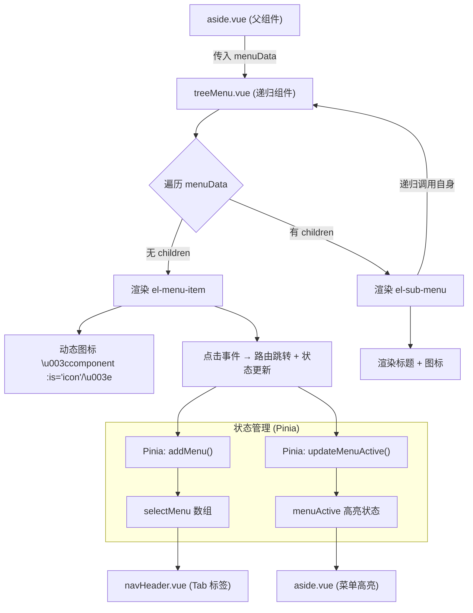

# 递归菜单组件与动态图标渲染详解

这份文档旨在将简历中的技术亮点与实际项目代码进行一一对应，帮助您在面试中能够深入浅出地讲解实现原理。

---

## 1. 核心架构与设计思想

本系统的侧边菜单栏采用了"**递归组件**"模式，支持无限层级的菜单嵌套。同时结合 Vue 的"**动态组件**"特性，实现了图标的按需渲染。

### 为什么需要递归组件？

传统的菜单渲染方式可能是这样的：

```vue
<!-- ❌ 传统写法：层级写死，不灵活 -->
<el-menu>
  <el-menu-item>一级菜单1</el-menu-item>
  <el-sub-menu>
    <template #title>一级菜单2</template>
    <el-menu-item>二级菜单1</el-menu-item>
    <el-sub-menu>
      <template #title>二级菜单2</template>
      <el-menu-item>三级菜单1</el-menu-item>
      <!-- 如果还有四级、五级呢？ -->
    </el-sub-menu>
  </el-sub-menu>
</el-menu>
```

**问题**：菜单层级是写死的，无法适应动态数据。

**解决方案**：组件调用自身（递归），根据数据结构自动渲染任意层级。

---

**整体流程图解：**



---

## 2. 组件架构分析

本系统的菜单渲染涉及 3 个核心组件：

| 组件              | 文件路径                       | 职责                                      |
| ----------------- | ------------------------------ | ----------------------------------------- |
| **aside.vue**     | `src/components/aside.vue`     | 侧边栏容器，读取菜单数据，传递给 treeMenu |
| **treeMenu.vue**  | `src/components/treeMenu.vue`  | 递归渲染菜单项，处理点击事件              |
| **navHeader.vue** | `src/components/navHeader.vue` | 顶部 Tab 标签，显示已打开的菜单           |

### 2.1 组件调用关系

```
main.vue (布局页面)
├── aside.vue (侧边栏容器)
│   └── treeMenu.vue (递归菜单 - 可嵌套无限层)
│       └── treeMenu.vue
│           └── treeMenu.vue
│               └── ...
└── navHeader.vue (顶部导航)
    └── Tab 标签列表 (由 treeMenu 点击事件触发更新)
```

---

## 3. 核心代码逐行精讲

### 3.1 侧边栏容器：`aside.vue`

这是菜单系统的"入口"，负责从 Pinia 读取菜单数据，并传递给递归组件。

```vue
<!-- 📁 src/components/aside.vue -->

<script setup>
import treeMenu from './treeMenu.vue'
import { computed } from 'vue'
import { useMenuStore } from '@/store/menu'

const menuStore = useMenuStore()

// 🔥 从 Pinia 读取菜单数据 (由 dynamicMenuRender Action 生成)
const menuData = computed(() => menuStore.routerList)

// 🔥 从 Pinia 读取折叠状态
const isCollapse = computed(() => menuStore.isCollapse)

// 🔥 从 Pinia 读取当前高亮的菜单索引
const active = computed(() => menuStore.menuActive)
</script>

<template>
  <el-menu
    :style="{ width: !isCollapse ? '230px' : '64px' }"
    active-text-color="#ffd04b"
    background-color="#545c64"
    :default-active="active"  <!-- 🔥 控制高亮 -->
    text-color="#fff"
    :collapse="isCollapse"    <!-- 🔥 控制折叠 -->
  >
    <p class="logo-lg">{{ !isCollapse ? 'DIDI陪诊' : 'DIDI' }}</p>

    <!-- 🔥 调用递归组件，传入菜单数据和初始层级索引 -->
    <treeMenu :menuData="menuData" :loopIndex="1" />
  </el-menu>
</template>
```

**关键点解析：**

| 代码                              | 说明                                                      |
| --------------------------------- | --------------------------------------------------------- |
| `menuData = menuStore.routerList` | 菜单数据来源于 Pinia，由登录时的 `dynamicMenuRender` 生成 |
| `:default-active="active"`        | Element Plus 的菜单高亮控制，值为菜单项的 `index` 属性    |
| `:loopIndex="1"`                  | 传入初始层级索引，用于生成唯一的菜单标识                  |

---

### 3.2 递归菜单组件：`treeMenu.vue`

这是整个菜单系统的"核心引擎"，通过递归调用自身实现无限层级渲染。

```vue
<!-- 📁 src/components/treeMenu.vue -->

<script setup>
import { useRouter } from 'vue-router'
import { useMenuStore } from '@/store/menu'

// 接收父组件传入的 props
const { menuData, loopIndex } = defineProps(['menuData', 'loopIndex'])

const menuStore = useMenuStore()
const router = useRouter()

// 🔥 菜单点击事件处理
const handleClick = (item, active) => {
  // 1. 路由跳转
  router.push(item.meta.path)

  // 2. 将点击的菜单信息添加到 Tab 标签列表
  menuStore.addMenu(item.meta)

  // 3. 更新当前高亮的菜单索引
  menuStore.updateMenuActive(active)
}
</script>

<template>
  <!-- 🔥 外层使用 <template> 而非 <div>，避免产生多余 DOM 节点 -->
  <template v-for="(item, index) in menuData" :key="index">
    <!-- 情况 1：没有子菜单 → 渲染 el-menu-item (叶子节点) -->
    <el-menu-item
      v-if="!item.children || item.children.length === 0"
      :index="`${loopIndex}-${item.meta.id}`"
      @click="handleClick(item, `${loopIndex}-${item.meta.id}`)"
    >
      <!-- 🔥 动态图标渲染 -->
      <el-icon size="20">
        <component :is="item.meta.icon"></component>
      </el-icon>
      <span>{{ item.meta.name }}</span>
    </el-menu-item>

    <!-- 情况 2：有子菜单 → 渲染 el-sub-menu (容器节点) -->
    <el-sub-menu v-else :index="`${index + 1}`">
      <template #title>
        <!-- 🔥 动态图标渲染 (同上) -->
        <el-icon size="20">
          <component :is="item.meta.icon"></component>
        </el-icon>
        <span>{{ item.meta.name }}</span>
      </template>

      <!-- 🔥 递归调用自身，传入子菜单数据和拼接后的层级索引 -->
      <treeMenu :menuData="item.children" :loopIndex="`${loopIndex}-${item.meta.id}`" />
    </el-sub-menu>
  </template>
</template>
```

---

## 4. 核心技术点详解

### 4.1 递归组件的工作原理

**递归的核心逻辑：**

```
对于每一个菜单项 (item)：
  如果 item 没有 children：
    → 渲染 <el-menu-item>（终止条件）
  如果 item 有 children：
    → 渲染 <el-sub-menu>
    → 递归调用 <treeMenu>，传入 item.children
```

**以三级菜单为例的递归过程：**

```
输入数据：
[
  {
    name: "权限管理",
    children: [
      {
        name: "账号管理",
        children: null  // 叶子节点
      },
      {
        name: "菜单管理",
        children: null  // 叶子节点
      }
    ]
  }
]

递归过程：
第 1 次调用 (loopIndex = 1):
  遍历到 "权限管理" → 有 children → 渲染 <el-sub-menu>
  递归调用 treeMenu，传入 children

第 2 次调用 (loopIndex = 1-2):
  遍历到 "账号管理" → 无 children → 渲染 <el-menu-item> → 结束
  遍历到 "菜单管理" → 无 children → 渲染 <el-menu-item> → 结束
```

---

### 4.2 层级索引 (loopIndex) 的设计

**问题**：Element Plus 的 `<el-menu>` 通过 `index` 属性来控制高亮状态，如何保证每个菜单项的 `index` 是唯一的？

**解决方案**：使用 `loopIndex` 进行层级拼接。

```
第一层菜单：loopIndex = "1"
  → 控制台 index = "1-1"
  → 权限管理 index = "1-2"

第二层菜单：loopIndex = "1-2"（继承父级 + 当前 id）
  → 账号管理 index = "1-2-1"
  → 菜单管理 index = "1-2-2"

第三层菜单：loopIndex = "1-2-2"
  → 某子菜单 index = "1-2-2-1"
```

**代码实现：**

```javascript
// 拼接当前层级索引
:index="`${loopIndex}-${item.meta.id}`"

// 递归时传递新的 loopIndex
:loopIndex="`${loopIndex}-${item.meta.id}`"
```

---

### 4.3 动态组件渲染图标

**问题**：菜单图标由后端数据决定，如何根据字符串动态渲染对应的图标组件？

**后端返回的数据结构：**

```json
{
  "meta": {
    "id": "1",
    "name": "控制台",
    "icon": "Platform", // 这是 Element Plus 图标组件名
    "path": "/dashboard"
  }
}
```

**传统写法的问题：**

```vue
<!-- ❌ 图标写死，无法动态化 -->
<el-icon><Platform /></el-icon>
```

**动态组件解决方案：**

```vue
<!-- ✅ 使用 Vue 动态组件，根据 item.meta.icon 动态渲染 -->
<el-icon size="20">
  <component :is="item.meta.icon"></component>
</el-icon>
```

**原理解析：**

| 属性                   | 说明                               |
| ---------------------- | ---------------------------------- |
| `<component>`          | Vue 内置的动态组件标签             |
| `:is="item.meta.icon"` | 根据 `is` 属性的值，渲染对应的组件 |

**为什么能直接用字符串渲染？**

在 `main.js` 中，已全局注册了所有 Element Plus 图标：

```javascript
// src/main.js
import * as ElementPlusIconsVue from '@element-plus/icons-vue'

for (const [key, component] of Object.entries(ElementPlusIconsVue)) {
  app.component(key, component)
}
```

所以 `<component :is="'Platform'">` 等价于 `<Platform />`。

---

### 4.4 点击事件与状态联动

**点击菜单项触发的操作：**

```javascript
const handleClick = (item, active) => {
  // 1. 路由跳转
  router.push(item.meta.path)

  // 2. 添加到顶部 Tab 标签列表
  menuStore.addMenu(item.meta)

  // 3. 更新菜单高亮状态
  menuStore.updateMenuActive(active)
}
```

**状态流转图：**

```
用户点击菜单项
       │
       ▼
┌─────────────────────────────────────────────┐
│  handleClick(item, active)                  │
│  ├─ router.push(path) → 右侧内容区切换       │
│  ├─ menuStore.addMenu(item.meta) → 更新Tab  │
│  └─ menuStore.updateMenuActive(active)      │
└─────────────────────────────────────────────┘
       │
       ▼
┌─────────────────────────────────────────────┐
│  Pinia Store 状态更新                        │
│  ├─ selectMenu: [..., newItem] → 新增Tab    │
│  └─ menuActive: "1-2-1" → 高亮当前菜单       │
└─────────────────────────────────────────────┘
       │
       ├─────────────────┬─────────────────────┐
       ▼                 ▼                     ▼
  aside.vue         navHeader.vue          main.vue
  (:default-active)  (Tab 列表渲染)         (router-view)
  菜单高亮更新        Tab 标签更新           页面内容更新
```

---

## 5. Pinia Store 中的相关 Actions

### 5.1 addMenu - 添加 Tab 标签

```javascript
// src/store/menu.js

addMenu(data) {
  // 使用 findIndex 去重：如果已存在相同 path，则不添加
  if (this.selectMenu.findIndex((item) => item.path === data.path) === -1) {
    this.selectMenu.push(data)
  }
}
```

**设计考量：** 用户多次点击同一菜单项，Tab 标签不会重复添加。

---

### 5.2 updateMenuActive - 更新高亮状态

```javascript
// src/store/menu.js

updateMenuActive(data) {
  this.menuActive = data  // 直接更新为传入的索引字符串
}
```

**与 aside.vue 的联动：**

```vue
<!-- aside.vue -->
<el-menu :default-active="active">
  <!-- active = menuStore.menuActive -->
</el-menu>
```

---

### 5.3 closeMenu - 关闭 Tab 标签

```javascript
// src/store/menu.js

closeMenu(data) {
  const index = this.selectMenu.findIndex((item) => item.name === data.name)
  this.selectMenu.splice(index, 1)  // 找到并删除
}
```

---

## 6. 顶部 Tab 标签的联动渲染

### 6.1 navHeader.vue 关键代码

```vue
<!-- 📁 src/components/navHeader.vue -->

<script setup>
const menuStore = useMenuStore()

// 从 Pinia 读取 Tab 列表
const selectMenu = computed(() => menuStore.selectMenu)
</script>

<template>
  <ul>
    <li
      v-for="(item, index) in selectMenu"
      :key="item.path"
      :class="{ selected: route.path === item.path }"
    >
      <!-- 🔥 Tab 标签中也使用动态图标 -->
      <el-icon size="12">
        <component :is="item.icon" />
      </el-icon>

      <router-link :to="{ path: item.path }">
        {{ item.name }}
      </router-link>

      <el-icon class="close" @click="closeTab(item, index)">
        <Close />
      </el-icon>
    </li>
  </ul>
</template>
```

### 6.2 关闭 Tab 的复杂逻辑

```javascript
const closeTab = (item, index) => {
  // 1. 删除 Tab
  menuStore.closeMenu(item)

  // 2. 如果删除的不是当前页面，不跳转
  if (item.path !== route.path) return

  // 3. 删除当前页面后的跳转逻辑
  if (index === selectMenu.value.length) {
    // 3.1 删除的是最后一项
    if (!selectMenu.value.length) {
      router.push('/') // Tab 空了，跳首页
    } else {
      router.push(selectMenu.value[index - 1].path) // 跳到前一项
    }
  } else {
    // 3.2 删除的不是最后一项，跳到后一项（自动前移）
    router.push(selectMenu.value[index].path)
  }
}
```

---

## 7. 面试常见问题

### Q1: 递归组件如何避免死循环？

> **A**: 递归必须有终止条件。在本组件中，终止条件是 `!item.children || item.children.length === 0`。当菜单项没有子菜单时，渲染 `<el-menu-item>` 而不再递归调用自身。

### Q2: 为什么外层用 `<template>` 而不是 `<div>`？

> **A**: `<template>` 是 Vue 的逻辑容器，不会在 DOM 中产生实际节点。使用 `<div>` 会在每一层递归产生一个包裹元素，导致 Element Plus 的样式错乱（如间距、缩进不正确）。

### Q3: 动态组件 `<component :is>` 有什么限制？

> **A**:
>
> 1. 组件必须已全局注册或在当前组件中引入
> 2. `:is` 的值可以是组件名字符串（全局注册时）或组件对象
> 3. 本项目通过 `main.js` 全局注册了所有 Element Plus 图标，所以可以直接用字符串

### Q4: 如何实现菜单高亮与路由同步？

> **A**:
>
> 1. 点击菜单时调用 `menuStore.updateMenuActive(index)` 更新 Pinia 状态
> 2. `aside.vue` 通过 `:default-active="active"` 绑定 Pinia 状态
> 3. Element Plus 的 `<el-menu>` 自动处理高亮渲染

### Q5: 层级索引为什么用字符串拼接而不是数字？

> **A**:
>
> 1. 多层级用数字会导致冲突（如 1 和 11 无法区分是"第一层第一个"还是"第十一个"）
> 2. 字符串拼接如 `"1-2-1"` 天然具有层级信息，方便调试
> 3. Element Plus 的 `index` 属性本身就是字符串类型

---

## 8. 简历描述建议

### 精简版

> 设计递归菜单组件支持无限层级嵌套，结合 Vue 动态组件实现图标按需渲染，菜单高亮状态通过 Pinia 全局管理，与顶部 Tab 标签联动。

### 技术深度版

> 基于 Vue 3 的递归组件模式实现动态菜单系统：
>
> 1. 通过 `<component :is>` 动态渲染 Element Plus 图标组件
> 2. 设计层级索引 (loopIndex) 机制保证菜单项唯一标识
> 3. 结合 Pinia 状态管理实现菜单高亮与 Tab 标签的双向联动
> 4. 处理 Tab 关闭后的路由跳转边界情况（删除当前/最后/中间等）

---

## 9. 代码运行效果示意

```
菜单数据结构：                          渲染结果：

├── 控制台 (无 children)      →   ▸ 控制台
├── 权限管理 (有 children)    →   ▾ 权限管理
│   ├── 账号管理              →      ▸ 账号管理
│   └── 菜单管理              →      ▸ 菜单管理
└── 陪诊管理 (有 children)    →   ▾ 陪诊管理
    ├── 陪护管理              →      ▸ 陪护管理
    └── 订单管理              →      ▸ 订单管理

点击 "账号管理" 后：
1. 路由跳转到 /auth/admin
2. 顶部出现 [账号管理] Tab 标签
3. 侧边栏 "账号管理" 高亮
```
