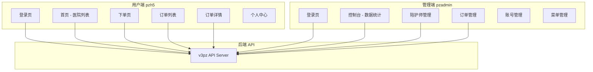
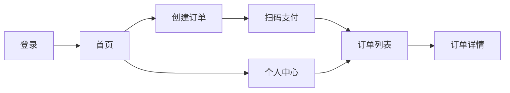
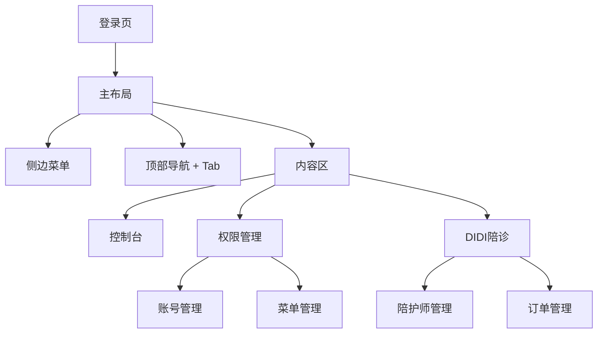
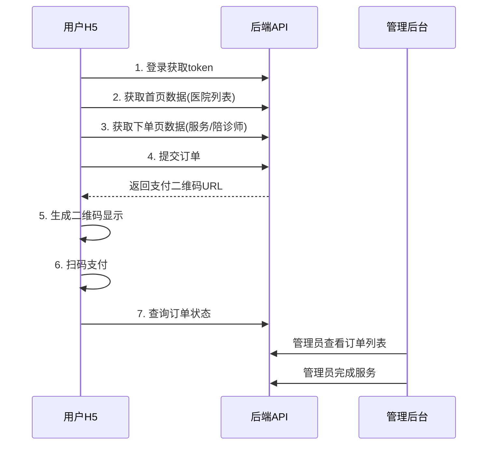

# 陪诊项目 (Medical Companion) 完整文档

> **项目概述**：这是一个医院陪诊服务平台，分为两个独立的前端应用：
>
> - **pzadmin** - 后台管理系统（PC端）
> - **pzh5** - 用户下单系统（移动端H5）

---

## 📊 技术栈总览

|                 | pzadmin (后台管理)              | pzh5 (H5下单)                   |
| --------------- | ------------------------------- | ------------------------------- |
| **框架**        | Vue 3.5 + Vite 7                | Vue 3.5 + Vite 7                |
| **UI库**        | Element Plus 2.11               | Vant 4.9                        |
| **状态管理**    | Vuex 4 + vuex-persistedstate    | localStorage                    |
| **路由**        | Vue Router 4 (Hash)             | Vue Router 4 (Hash)             |
| **HTTP**        | Axios 1.12                      | Axios 1.12                      |
| **图表**        | ECharts 6.0                     | -                               |
| **二维码**      | -                               | qrcode 1.5                      |
| **移动适配**    | -                               | postcss-pxtorem + amfe-flexible |
| **CSS预处理**   | Less                            | Less                            |
| **API基础地址** | `https://v3pz.itndedu.com/v3pz` | `https://v3pz.itndedu.com/v3pz` |

---

## 🏗️ 项目架构图



---

## 📁 目录结构

### pzadmin (后台管理)

```
d:\didi\pzadmin\src\
├── api/
│   └── index.js              # 16个API接口
├── components/
│   ├── aside.vue             # 侧边栏组件
│   ├── navHeader.vue         # 顶部导航+Tab标签
│   ├── panelHead.vue         # 页面头部面板
│   └── treeMenu.vue          # 树形菜单组件
├── router/
│   └── index.js              # 路由配置 (动态路由)
├── store/
│   ├── index.js              # Vuex入口
│   └── menu.js               # 菜单状态管理
├── utils/
│   └── request.js            # Axios封装
├── views/
│   ├── login/index.vue       # 登录页
│   ├── main.vue              # 布局容器
│   ├── dashboard/index.vue   # 控制台/数据看板
│   ├── auth/
│   │   ├── admin/index.vue   # 账号管理
│   │   └── group/index.vue   # 菜单管理
│   └── vppz/
│       ├── staff/index.vue   # 陪护师管理
│       └── order/index.vue   # 订单管理
├── App.vue
├── main.js
└── style.css
```

### pzh5 (H5下单)

```
d:\didi\pzh5\src\
├── api/
│   └── index.js              # 6个API接口
├── components/
│   ├── counter.vue           # 倒计时组件
│   └── orderStatusBar.vue    # 订单状态进度条
├── pages/
│   ├── Main.vue              # Tabbar布局容器
│   ├── login/index.vue       # 登录页
│   ├── home/index.vue        # 首页 (医院列表)
│   ├── createOrder/index.vue # 创建订单页
│   ├── order/index.vue       # 订单列表页
│   ├── detail/index.vue      # 订单详情页
│   └── user/index.vue        # 个人中心
├── router/
│   └── index.js              # 路由配置
├── utils/
│   ├── request.js            # Axios封装
│   └── ...
├── App.vue
└── main.js
```

---

## 🔐 认证与权限机制

### Token 管理

|               | pzadmin                    | pzh5                       |
| ------------- | -------------------------- | -------------------------- |
| **Token存储** | `localStorage.pz_token`    | `localStorage.h5_token`    |
| **用户信息**  | `localStorage.pz_userInfo` | `localStorage.h5_userInfo` |
| **请求头**    | `X-token`                  | `h-token`                  |
| **终端标识**  | -                          | `terminal: h5`             |

### 请求拦截器逻辑

```javascript
// 白名单接口 (不需要token)
const whiteUrl = ["/login", "/get/code", "/user/authentication"];

// 请求拦截器
if (token && !whiteUrl.includes(config.url)) {
  config.headers["X-token"] = token; // admin
  // config.headers['h-token'] = token  // h5
}

// 响应拦截器
if (response.data.code === -1) {
  /* 显示警告消息 */
}
if (response.data.code === -2) {
  /* Token过期，清除数据，跳转登录 */
}
```

### 动态路由 (pzadmin特有)

后台系统实现了**基于权限的动态路由**：

```javascript
// store/menu.js - DynamicMenuRender mutation
DynamicMenuRender(state, data) {
  // 1. 使用 Vite 的 import.meta.glob 批量导入组件
  const modules = import.meta.glob('../views/**/**/*.vue')

  // 2. 递归处理菜单数据，拼接组件路径
  function routerSet(data) {
    data.forEach(item => {
      if (!item.children) {
        const url = `../views${item.meta.path}/index.vue`
        item.component = modules[url]  // 路由懒加载
      } else {
        routerSet(item.children)
      }
    })
  }
  routerSet(data)
  state.routerList = data
}
```

---

## 📱 pzh5 - 用户端详解

### 页面流程图



### 1. 登录页 `/login`

**文件**: `pages/login/index.vue`

```vue
<van-form @submit="onSubmit">
  <van-field v-model="form.userName" :rules="[{ required: true }]" />
  <van-field v-model="form.passWord" type="password" :rules="[{ required: true }]" />
  <van-button native-type="submit">提交</van-button>
</van-form>
```

**关键点**：

- 使用 Vant Form 内置校验
- 登录成功后存储 `h5_token` 和 `h5_userInfo`

---

### 2. 首页 `/home`

**文件**: `pages/home/index.vue`

**功能模块**：
| 模块 | 组件 | 数据来源 |
|---|---|---|
| 搜索栏 | `van-search` | - |
| 轮播图 | `van-swipe` | `homeData.slides` |
| 快捷入口 | `van-row` + `van-col` | `homeData.nav2s` |
| 医院列表 | `van-row` 循环 | `homeData.hospitals` |

**点击医院卡片** → 跳转创建订单页，携带医院ID：

```javascript
router.push(`/createOrder?id=${item.id}`);
```

---

### 3. 创建订单页 `/createOrder`

**文件**: `pages/createOrder/index.vue`

**表单字段**：

```javascript
const form = ref({
  hospital_id: "", // 医院ID
  hospital_name: "", // 医院名称
  demand: "", // 服务需求描述
  companion_id: 0, // 陪诊师ID
  receiveAddress: "", // 接送地址
  tel: "", // 联系电话
  starttime: 0, // 就诊时间戳
});
```

**弹窗选择器**：

- 医院选择器 (`van-picker`)
- 日期选择器 (`van-date-picker`)
- 陪诊师选择器 (`van-picker`)

**微信支付二维码**：

```javascript
import QRCode from "qrcode";

// 提交订单后生成二维码
const res = await submitCreateOrderAPI(form.value);
url.value = await QRCode.toDataURL(res.data.data.wx_code);
showCode.value = true; // 显示二维码弹窗
```

---

### 4. 订单列表页 `/order`

**文件**: `pages/order/index.vue`

**Tab状态筛选**：
| Tab | name值 | 对应状态 |
|---|---|---|
| 全部 | `''` | 所有订单 |
| 待支付 | `'1'` | 待支付 |
| 待服务 | `'2'` | 待服务 |
| 已完成 | `'3'` | 已完成 |
| 已取消 | `'4'` | 已取消 |

**倒计时组件**：

```vue
<counter :millisecond="item.countdown" v-if="item.trade_state === '待支付'" />
```

**倒计时计算** (2小时 = 7200000毫秒)：

```javascript
item.countdown = item.order_start_time + 7200000 - Date.now();
```

---

### 5. 订单详情页 `/detail`

**文件**: `pages/detail/index.vue`

**根据订单状态显示不同UI**：

```vue
<div v-if="deatilPageData.trade_state === '待支付'">
  订单待支付 + 倒计时 + 支付按钮
</div>
<div v-if="deatilPageData.trade_state === '待服务'">
  正在安排服务专员...
</div>
<div v-if="deatilPageData.trade_state === '已完成'">
  服务已完成
</div>
<div v-if="deatilPageData.trade_state === '已取消'">
  订单已取消
</div>
```

**嵌套数据取值** (如 `client.name`)：

```javascript
const formatData = (key) => {
  if (key.indexOf(".") === -1) {
    return deatilPageData.value[key];
  }
  // 处理嵌套键名如 'client.name'
  return key.split(".").reduce((o, p) => (o || {})[p], deatilPageData.value);
};
```

---

### 6. 个人中心 `/user`

**文件**: `pages/user/index.vue`

**功能**：

- 显示用户头像和昵称 (从 `localStorage.h5_userInfo` 读取)
- 订单快捷入口 (待支付/待服务/已完成/已取消)
- 分享功能 (`van-share-sheet`)
- 退出登录 (清除 localStorage，跳转登录页)

---

## 💼 pzadmin - 后台管理详解

### 页面结构



---

### 1. 控制台 `/dashboard`

**文件**: `views/dashboard/index.vue`

**数据展示**：
| 模块 | 数据源 | 展示方式 |
|---|---|---|
| 用户信息 | `dashboardData.user` | 头像+权限+IP |
| 订单状态统计 | `dashboardData.types` | 4个彩色卡片 |
| 每日订单量 | `dashboardData.typeList` | ECharts折线图 |

**ECharts配置亮点**：

```javascript
// 响应式图表
const observer = new ResizeObserver(() => {
  myChart.resize();
});
observer.observe(echartRef.value);
```

---

### 2. 陪护师管理 `/vppz/staff`

**文件**: `views/vppz/staff/index.vue`

**CRUD功能**：
| 操作 | API | 说明 |
|---|---|---|
| 列表 | `getAccompanyDataListAPI` | 分页查询 |
| 新增/编辑 | `submitAccompanyDataAPI` | 同一接口，根据ID判断 |
| 删除 | `deleteAccompanyDataAPI` | 批量删除 |
| 头像选择 | `getAccompanyPhotosAPI` | 从服务器获取头像列表 |

**表单字段**：

```javascript
const form = ref({
  id: "",
  mobile: "", // 手机号 (带正则校验)
  active: 1, // 状态: 0失效, 1生效
  age: 28,
  avatar: "", // 头像URL
  name: "",
  sex: "", // '1'男, '2'女
});
```

**手机号校验**：

```javascript
const validateMobile = (rule, value, callback) => {
  const reg =
    /^1(3[0-9]|4[01456879]|5[0-35-9]|6[2567]|7[0-8]|8[0-9]|9[0-35-9])\d{8}$/;
  reg.test(value) ? callback() : callback(new Error("手机号格式不对"));
};
```

---

### 3. 订单管理 `/vppz/order`

**文件**: `views/vppz/order/index.vue`

**表格列**：
| 字段 | 说明 |
|---|---|
| `out_trade_no` | 订单号 (固定左侧) |
| `hospital_name` | 就诊医院 |
| `service_name` | 陪诊服务 |
| `companion` | 陪护师 (头像+手机号) |
| `price` / `paidPrice` | 总价/已付 |
| `trade_state` | 订单状态 (Tag颜色) |
| `service_state` | 接单状态 |

**订单状态颜色映射**：

```javascript
const statusSet = (key) => {
  const orderStatus = {
    已取消: "info",
    待支付: "warning",
    已完成: "success",
  };
  return orderStatus[key];
};
```

**完成服务操作**：

```javascript
const confirmCompleteOrderService = async (id) => {
  await orderServiceStatusChangeAPI({ id });
  getOrderList(); // 刷新列表
};
```

---

## 🔌 API 接口一览

### pzadmin 接口 (16个)

| 分类         | 接口                   | 方法 | 说明            |
| ------------ | ---------------------- | ---- | --------------- |
| **登录**     | `/get/code`            | POST | 发送验证码      |
|              | `/user/authentication` | POST | 注册用户        |
|              | `/login`               | POST | 登录            |
| **菜单权限** | `/user/getmenu`        | GET  | 获取菜单权限    |
|              | `/user/setmenu`        | POST | 修改菜单权限    |
|              | `/menu/list`           | GET  | 菜单列表        |
| **账号管理** | `/auth/admin`          | GET  | 账号列表        |
|              | `/menu/selectlist`     | GET  | 下拉列表数据    |
|              | `/update/user`         | POST | 修改账号        |
|              | `/menu/permissions`    | GET  | 账号菜单权限    |
| **陪护师**   | `/photo/list`          | GET  | 头像列表        |
|              | `/companion`           | POST | 添加/编辑陪护师 |
|              | `/companion/list`      | GET  | 陪护师列表      |
|              | `/delete/companion`    | POST | 删除陪护师      |
| **订单**     | `/admin/order`         | GET  | 订单列表        |
|              | `/update/order`        | POST | 更新订单状态    |
| **统计**     | `/report`              | GET  | 控制台统计数据  |

### pzh5 接口 (6个)

| 接口            | 方法 | 说明           |
| --------------- | ---- | -------------- |
| `/login`        | POST | 用户登录       |
| `/Index/index`  | GET  | 首页数据       |
| `/h5/companion` | GET  | 创建订单页数据 |
| `/createOrder`  | POST | 提交订单       |
| `/order/list`   | GET  | 订单列表       |
| `/order/detail` | GET  | 订单详情       |

---

## 🎨 核心组件

### pzh5 - 倒计时组件

**文件**: `components/counter.vue`

```vue
<script setup>
const props = defineProps({
  millisecond: Number, // 剩余毫秒数
});
// 格式化为 HH:MM:SS
</script>
```

### pzh5 - 订单状态进度条

**文件**: `components/orderStatusBar.vue`

```vue
<script setup>
const props = defineProps({
  item: Number, // 0=下单, 10=待支付, 20=待服务, 30=已完成, 40=已取消
});
</script>
```

### pzadmin - 侧边栏菜单

**文件**: `components/aside.vue`

- 支持展开/收起
- 根据 Vuex 中的 `routerList` 动态渲染
- 配合 `treeMenu.vue` 实现多级菜单

### pzadmin - 顶部导航

**文件**: `components/navHeader.vue`

- Tab 标签页导航
- 点击菜单时添加 Tab
- 关闭 Tab 时从 Vuex 移除

---

## 💡 技术亮点

### 1. 动态路由 + 权限控制 (pzadmin)

- 使用 `import.meta.glob` 批量导入组件
- 根据后端返回的菜单数据动态生成路由
- 实现路由懒加载

### 2. Vuex 持久化 (pzadmin)

```javascript
import createPersistedState from "vuex-persistedstate";

export default createStore({
  plugins: [new createPersistedState({ key: "Vuex_data" })],
});
```

### 3. 移动端适配 (pzh5)

- 使用 `postcss-pxtorem` 自动转换 px 为 rem
- 使用 `amfe-flexible` 设置根字体大小

### 4. 二维码支付 (pzh5)

```javascript
import QRCode from "qrcode";
const url = await QRCode.toDataURL(paymentUrl);
```

### 5. 响应式 ECharts (pzadmin)

```javascript
const observer = new ResizeObserver(() => myChart.resize());
observer.observe(echartRef.value);
```

---

## 📝 数据流说明

### 下单流程



---

## 🚀 快速运行

### pzadmin

```bash
cd d:\didi\pzadmin
npm install
npm run dev
```

### pzh5

```bash
cd d:\didi\pzh5
npm install
npm run dev
```

### 测试账号

> 请联系后端获取测试账号密码

---

## 📌 总结

这是一个完整的**医院陪诊服务平台**：

| 系统        | 用户    | 核心功能                                 |
| ----------- | ------- | ---------------------------------------- |
| **pzh5**    | C端用户 | 浏览医院、选择陪诊师、下单支付、查看订单 |
| **pzadmin** | 管理员  | 数据统计、陪护师管理、订单管理、权限管理 |

**技术特点**：

- 前后端分离架构
- Vue 3 Composition API
- 基于角色的动态路由
- 移动端响应式设计
- 微信支付集成

---

## 📖 代码阅读顺序指南

> 以下阅读顺序按照**依赖关系**排列，确保你在阅读某个文件时，它所依赖的模块你已经看过了。

---

### 🔷 pzadmin (后台管理端) 阅读顺序

#### 第一阶段：项目配置与入口 (3个文件)

| 顺序 | 文件路径         | 说明         | 关注点                                                    |
| :--: | ---------------- | ------------ | --------------------------------------------------------- |
|  1   | `package.json`   | 项目依赖清单 | 了解使用了哪些库：Vue3、Element Plus、Vuex、ECharts等     |
|  2   | `vite.config.js` | Vite配置     | 路径别名 `@`、自动导入插件配置                            |
|  3   | `src/main.js`    | 应用入口     | Vue实例创建、插件注册顺序（Router → Store → ElementPlus） |

---

#### 第二阶段：工具层 (1个文件)

| 顺序 | 文件路径               | 说明      | 关注点                                                          |
| :--: | ---------------------- | --------- | --------------------------------------------------------------- |
|  4   | `src/utils/request.js` | Axios封装 | baseURL、请求拦截器(Token注入)、响应拦截器(错误处理、Token过期) |

---

#### 第三阶段：API层 (1个文件)

| 顺序 | 文件路径           | 说明        | 关注点                                 |
| :--: | ------------------ | ----------- | -------------------------------------- |
|  5   | `src/api/index.js` | 所有API接口 | 16个接口定义，了解整个项目的数据交互点 |

---

#### 第四阶段：状态管理 (2个文件)

| 顺序 | 文件路径             | 说明      | 关注点                                                  |
| :--: | -------------------- | --------- | ------------------------------------------------------- |
|  6   | `src/store/menu.js`  | 菜单模块  | state结构、`DynamicMenuRender`动态路由核心逻辑、Tab管理 |
|  7   | `src/store/index.js` | Store入口 | vuex-persistedstate持久化配置                           |

---

#### 第五阶段：路由配置 (1个文件)

| 顺序 | 文件路径              | 说明     | 关注点                                              |
| :--: | --------------------- | -------- | --------------------------------------------------- |
|  8   | `src/router/index.js` | 路由定义 | 动态重定向逻辑、路由结构（需结合store/menu.js理解） |

---

#### 第六阶段：公共组件 (4个文件)

> ⚠️ 组件之间的依赖关系：`treeMenu` → `aside` → `navHeader` → `main.vue`

| 顺序 | 文件路径                       | 说明         | 关注点                                |
| :--: | ------------------------------ | ------------ | ------------------------------------- |
|  9   | `src/components/panelHead.vue` | 页面头部面板 | 接收route.meta渲染标题和描述，无依赖  |
|  10  | `src/components/treeMenu.vue`  | 递归菜单组件 | 递归渲染多级菜单的核心逻辑            |
|  11  | `src/components/aside.vue`     | 侧边栏容器   | 依赖treeMenu，控制菜单展开收起        |
|  12  | `src/components/navHeader.vue` | 顶部导航     | Tab标签管理，依赖Vuex的selectMenu数组 |

---

#### 第七阶段：页面视图 (6个文件)

> ⚠️ 先看布局容器，再看登录页，最后看业务页面

| 顺序 | 文件路径                         | 说明       | 关注点                                           |
| :--: | -------------------------------- | ---------- | ------------------------------------------------ |
|  13  | `src/views/main.vue`             | 主布局容器 | el-container布局、组合aside+navHeader+RouterView |
|  14  | `src/views/login/index.vue`      | 登录页     | 表单验证、登录API调用、动态路由初始化触发        |
|  15  | `src/views/dashboard/index.vue`  | 控制台     | ECharts初始化、ResizeObserver响应式、API数据处理 |
|  16  | `src/views/auth/admin/index.vue` | 账号管理   | 表格CRUD模式、权限下拉选择                       |
|  17  | `src/views/auth/group/index.vue` | 菜单管理   | 树形数据编辑                                     |
|  18  | `src/views/vppz/staff/index.vue` | 陪护师管理 | 完整CRUD、图片选择器、表单校验、分页             |
|  19  | `src/views/vppz/order/index.vue` | 订单管理   | 表格渲染、状态映射、搜索、服务状态变更           |

---

#### 第八阶段：根组件与样式 (2个文件)

| 顺序 | 文件路径        | 说明     | 关注点         |
| :--: | --------------- | -------- | -------------- |
|  20  | `src/App.vue`   | 根组件   | RouterView出口 |
|  21  | `src/style.css` | 全局样式 | 基础样式重置   |

---

### 🔶 pzh5 (H5用户端) 阅读顺序

#### 第一阶段：项目配置与入口 (4个文件)

| 顺序 | 文件路径            | 说明        | 关注点                                        |
| :--: | ------------------- | ----------- | --------------------------------------------- |
|  1   | `package.json`      | 项目依赖    | Vant、qrcode、postcss-pxtorem等移动端特有依赖 |
|  2   | `vite.config.js`    | Vite配置    | Vant自动导入resolver                          |
|  3   | `postcss.config.js` | PostCSS配置 | px转rem配置、rootValue、propList              |
|  4   | `src/main.js`       | 应用入口    | amfe-flexible导入（移动端适配关键）           |

---

#### 第二阶段：工具层 (1个文件)

| 顺序 | 文件路径               | 说明      | 关注点                                          |
| :--: | ---------------------- | --------- | ----------------------------------------------- |
|  5   | `src/utils/request.js` | Axios封装 | h-token请求头、terminal:h5标识、Vant Notify提示 |

---

#### 第三阶段：API层 (1个文件)

| 顺序 | 文件路径           | 说明        | 关注点                   |
| :--: | ------------------ | ----------- | ------------------------ |
|  6   | `src/api/index.js` | 所有API接口 | 6个接口，比admin简洁很多 |

---

#### 第四阶段：路由配置 (1个文件)

| 顺序 | 文件路径              | 说明     | 关注点                                         |
| :--: | --------------------- | -------- | ---------------------------------------------- |
|  7   | `src/router/index.js` | 路由定义 | 嵌套路由结构、meta中的icon和name用于Tabbar渲染 |

---

#### 第五阶段：公共组件 (2个文件)

> ⚠️ 这两个组件被多个页面使用，必须先看

| 顺序 | 文件路径                            | 说明       | 关注点                                            |
| :--: | ----------------------------------- | ---------- | ------------------------------------------------- |
|  8   | `src/components/counter.vue`        | 倒计时组件 | 接收毫秒数、格式化显示、被order和detail页面使用   |
|  9   | `src/components/orderStatusBar.vue` | 订单进度条 | 接收状态值、步骤条样式、被createOrder和detail使用 |

---

#### 第六阶段：布局容器 (1个文件)

| 顺序 | 文件路径             | 说明       | 关注点                                       |
| :--: | -------------------- | ---------- | -------------------------------------------- |
|  10  | `src/pages/Main.vue` | Tabbar布局 | 动态渲染底部Tab、watch监听路由同步active状态 |

---

#### 第七阶段：页面视图 (6个文件)

> ⚠️ 按用户操作流程排序：登录 → 首页 → 下单 → 订单列表 → 订单详情 → 个人中心

| 顺序 | 文件路径                          | 说明     | 关注点                                             |
| :--: | --------------------------------- | -------- | -------------------------------------------------- |
|  11  | `src/pages/login/index.vue`       | 登录页   | Vant Form校验、localStorage存储token和userInfo     |
|  12  | `src/pages/home/index.vue`        | 首页     | Swipe轮播、医院列表渲染、路由跳转携带参数          |
|  13  | `src/pages/createOrder/index.vue` | 创建订单 | 表单收集、Popup+Picker弹窗选择、QRCode二维码生成   |
|  14  | `src/pages/order/index.vue`       | 订单列表 | Tab筛选、列表渲染、使用counter组件、路由query参数  |
|  15  | `src/pages/detail/index.vue`      | 订单详情 | 状态条件渲染、嵌套数据取值formatData、支付二维码   |
|  16  | `src/pages/user/index.vue`        | 个人中心 | 读取localStorage用户信息、ShareSheet分享、退出登录 |

---

#### 第八阶段：根组件 (1个文件)

| 顺序 | 文件路径      | 说明   | 关注点         |
| :--: | ------------- | ------ | -------------- |
|  17  | `src/App.vue` | 根组件 | RouterView出口 |

---

### 📋 阅读检查清单

#### pzadmin 阅读完成检查

- [ ] 理解Vuex持久化如何保存登录状态
- [ ] 理解动态路由是如何从后端数据生成的
- [ ] 理解`import.meta.glob`批量导入组件的原理
- [ ] 理解treeMenu递归渲染菜单的逻辑
- [ ] 理解ECharts响应式resize的实现
- [ ] 熟悉Element Plus表格、表单、对话框的使用
- [ ] 理解陪护师CRUD的完整流程

#### pzh5 阅读完成检查

- [ ] 理解postcss-pxtorem + amfe-flexible移动端适配原理
- [ ] 理解Vant Tabbar如何根据路由配置动态渲染
- [ ] 理解订单创建流程（选医院→选日期→选陪诊师→提交）
- [ ] 理解QRCode库如何将URL转为二维码图片
- [ ] 理解倒计时计算逻辑（下单时间+2小时-当前时间）
- [ ] 理解嵌套对象取值的reduce技巧
- [ ] 熟悉Vant Popup、Picker、Form等组件的使用

---

### 🎯 推荐阅读方式

1. **第一遍：快速浏览**
   - 每个文件花5分钟，了解大致结构和职责
   - 不纠结细节，建立整体认知

2. **第二遍：重点精读**
   - 重点看带注释的核心逻辑
   - 对照API文档理解数据流

3. **第三遍：动手调试**
   - 运行项目，打断点调试
   - 修改代码观察效果

---

### ⏱️ 预计阅读时间

| 项目     | 文件数       | 预计时间    |
| -------- | ------------ | ----------- |
| pzadmin  | 21个文件     | 3-4小时     |
| pzh5     | 17个文件     | 2-3小时     |
| **总计** | **38个文件** | **5-7小时** |
